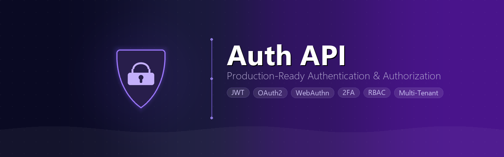

<p align="center">
  
</p>

<div align="center">

A complete authentication and authorization system with multi-tenancy, social login, WebAuthn/passkeys, magic link login, role-based access control, two-factor authentication, session management, email verification, JWT tokens, admin GUI, and activity logging.

[](https://golang.org)
[](LICENSE)
[](https://www.docker.com/)
[](http://localhost:8080/swagger/index.html)

[Quick Start](#quick-start) · [Documentation](#documentation) · [Contributing](#contributing)

</div>

---

## Features

- **Multi-Tenancy** -- Serve multiple organizations and applications from a single deployment with complete data isolation
- **Authentication** -- Registration, login, JWT access/refresh tokens, token blacklisting, password reset, email verification, resend verification
- **WebAuthn/Passkeys** -- FIDO2 passkey registration, passkey as 2FA method, and fully passwordless login via discoverable credentials
- **Magic Link Login** -- Passwordless authentication via email magic links for both users and admin accounts
- **Two-Factor Authentication** -- TOTP with authenticator apps, SMS-based 2FA, email-based 2FA, passkey-based 2FA, backup email recovery, recovery codes, and trusted devices
- **Social Login** -- Google, Facebook, and GitHub OAuth2 with account linking and unlinking
- **OIDC Provider** -- Each application can act as a standards-compliant OpenID Connect issuer (Authorization Code + PKCE, RS256 ID tokens, JWKS, introspection, token revocation)
- **Webhook System** -- Register HTTP endpoints to receive HMAC-signed event notifications with delivery tracking and automatic retries
- **Brute-Force Protection** -- Per-application account lockout, progressive login delays, and CAPTCHA trigger thresholds
- **GeoIP & IP Rules** -- MaxMind GeoLite2-based IP access rules with CIDR/country allow-lists and block-lists per application
- **API Key Scopes & Usage** -- Granular permission scopes on API keys with per-key daily usage analytics and expiry notifications
- **Health & Metrics** -- `GET /health` liveness check and `GET /metrics` Prometheus endpoint with request and system metrics
- **Role-Based Access Control** -- Per-application roles and permissions with admin management and self-healing default role assignment
- **Session Management** -- List active sessions across devices, revoke individual sessions, and revoke all other sessions
- **Admin GUI** -- Built-in web panel for managing tenants, apps, users, OAuth configs, API keys, roles, permissions, sessions, webhooks, OIDC clients, IP rules, monitoring, and settings
- **Activity Logging** -- Smart event categorization, anomaly detection, CSV export, and automatic retention cleanup
- **User Import/Export** -- Bulk CSV export and import of user accounts via the admin panel
- **Security Hardening** -- Rate limiting, security headers, timing-safe CSRF, JWT token type enforcement, Redis session validation
- **API Documentation** -- Interactive Swagger UI

---

## Quick Start

**Prerequisites:** Docker & Docker Compose (recommended), or Go 1.23+, PostgreSQL 13+, Redis 6+

```bash
# Clone and configure
git clone <repository-url>
cd <project-directory>
cp .env.example .env        # Edit with your settings

# Start services
./setup-network.sh create   # First time only
make docker-dev              # Start PostgreSQL, Redis, and the API
make migrate-up              # Apply database migrations
```

The API is now running at `http://localhost:8080`
Swagger docs at `http://localhost:8080/swagger/index.html`

All API requests require the `X-App-ID` header. The default app ID `00000000-0000-0000-0000-000000000001` is created automatically.

```bash
curl -X POST http://localhost:8080/auth/register \
  -H "X-App-ID: 00000000-0000-0000-0000-000000000001" \
  -H "Content-Type: application/json" \
  -d '{"email":"user@example.com","password":"Pass123!@#"}'
```

For detailed setup instructions, see [Getting Started](docs/getting-started.md).

---

## Documentation

| Document | Description |
|----------|-------------|
| **[Getting Started](docs/getting-started.md)** | Installation, setup, and first steps |
| **[Configuration](docs/configuration.md)** | Environment variables and OAuth setup |
| **[API Endpoints](docs/api-endpoints.md)** | Full endpoint reference and auth flows |
| **[Multi-Tenancy](docs/multi-tenancy.md)** | Tenant/app management and data isolation |
| **[Admin GUI](docs/admin-gui.md)** | Built-in admin panel setup and usage |
| **[Activity Logging](docs/activity-logging.md)** | Smart logging, anomaly detection, retention |
| **[Database Migrations](docs/database-migrations.md)** | Migration system and commands |
| **[Testing](docs/testing.md)** | Running tests and coverage |
| **[Project Structure](docs/project-structure.md)** | Codebase layout and architecture |
| **[Makefile Reference](docs/makefile-reference.md)** | All available make commands |
| **[Architecture](docs/ARCHITECTURE.md)** | System design and patterns |
| **[API Reference (detailed)](docs/API.md)** | Full request/response documentation |
| **[Changelog](CHANGELOG.md)** | Version history and release notes |

For early fork users upgrading from before multi-tenancy was added, see the [Pre-Release Migration Reference](docs/BREAKING_CHANGES.md).

---

## Tech Stack

| Category | Technology |
|----------|-----------|
| Language | Go 1.23+ |
| Web Framework | [Gin](https://github.com/gin-gonic/gin) |
| Database | PostgreSQL 13+ with [GORM](https://gorm.io/) |
| Cache/Sessions | Redis 6+ with [go-redis](https://github.com/redis/go-redis) |
| Authentication | JWT ([golang-jwt](https://github.com/golang-jwt/jwt)), OAuth2 |
| WebAuthn | [go-webauthn](https://github.com/go-webauthn/webauthn) |
| 2FA | TOTP ([pquerna/otp](https://github.com/pquerna/otp)), SMS (Twilio) |
| OIDC | Built-in OpenID Connect provider (RS256, PKCE, JWKS) |
| GeoIP | MaxMind GeoLite2 |
| Metrics | Prometheus |
| API Docs | [Swagger/Swaggo](https://github.com/swaggo/swag) |
| Admin GUI | Go Templates, HTMX, Bootstrap 5 |
| Containerization | Docker, Docker Compose |

---

## Contributing

Contributions are welcome. Please read [CONTRIBUTING.md](CONTRIBUTING.md) and [CODE_OF_CONDUCT.md](CODE_OF_CONDUCT.md) before opening a pull request.

```bash
# Development workflow
make dev              # Start with hot reload
make test             # Run tests
make fmt && make lint # Format and lint
make security         # Security checks
```

---

## Security

For reporting vulnerabilities, **do not create public issues**. Read [SECURITY.md](SECURITY.md) for instructions on responsible disclosure.

---

## License

This project is licensed under the MIT License. See [LICENSE](LICENSE) for details.
